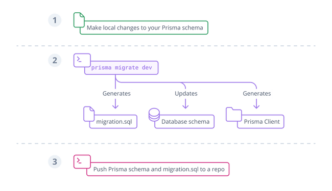
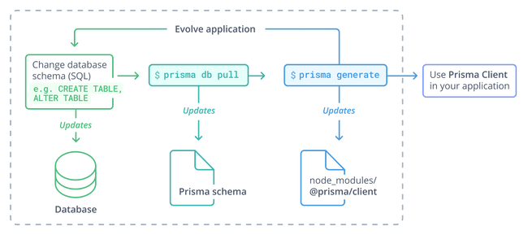

# Prisma学习笔记

> 笔记摘自Prisma官网使用指南[Concepts (prisma.io)](https://www.prisma.io/docs/concepts)


## Prisma 是什么

### 组成

- **Prisma Client**：用于 Node.js 和 TypeScript 的自动生成和类型安全的查询构建器
- **Prisma Migrate**：迁移系统
- **Prisma Studio**：用于查看和编辑数据库中数据的GUI系统。

### 使用

### Prisma schema

以一种直观地形式定义应用模型的数据定义语言。

```scheme
datasource db {
  provider = "postgresql"
  url      = env("DATABASE_URL")
}

generator client {
  provider = "prisma-client-js"
}

model Post {
  id        Int     @id @default(autoincrement())
  title     String
  content   String?
  published Boolean @default(false)
  author    User?   @relation(fields: [authorId], references: [id])
  authorId  Int?
}

model User {
  id    Int     @id @default(autoincrement())
  email String  @unique
  name  String?
  posts Post[]
}
```

使用 Prisma schema 配置以下三种：

1. **Data source**：指定数据库的连接
2. **Generator**：指定生成Prisma Client
3. **Data model**：定义应用模型

#### 获取数据模型

- 手动编写数据模型并使用[Prisma Migrate](https://www.prisma.io/docs/concepts/components/prisma-migrate) 将其映射到数据库
- 通过[自检](https://www.prisma.io/docs/concepts/components/introspection)数据库生成数据模型

#### 连接数据库

使用`prisma client`连接数据库。

1. 前置依赖

   `npm install @prisma/client`

2. 运行命令生成数据模型

   `prisma generate`，代码默认生成到文件夹[ `node_modules/.prisma/client`](https://www.prisma.io/docs/concepts/components/prisma-client/working-with-prismaclient/generating-prisma-client#the-prismaclient-npm-package).

3. 代码使用

   ```typescript
   import { PrismaClient } from '@prisma/client'
   
   const prisma = new PrismaClient()
   ```

## 典型 Prisma 工作流

### Prisma Migrate

> 数据库还没架构（建表之类的），代码生成相应的架构。

1. 手动调整[Prisma数据模型](https://www.prisma.io/docs/concepts/components/prisma-schema/data-model)
2. 使用 CLI 命令迁移开发数据库`prisma migrate dev`
3. 在应用程序代码中使用Prisma Client访问数据库



更多：

- [Deploying database changes with Prisma Migrate](https://www.prisma.io/docs/guides/deployment/deploy-database-changes-with-prisma-migrate)

- [Developing with Prisma Migrate](https://www.prisma.io/docs/guides/migrate/developing-with-prisma-migrate)

### SQL 迁移和自检

> 已有数据库架构（建好表了之类的），根据数据库的架构生成Prisma schema、Prisma client。

出于某些原因不想使用 Prisma Migrate，可以使用自检的方式从数据库架构(database schema)更新 Prisma Client。

1. 使用SQL或三方工具调整数据库架构
2. 自检或重新自检数据库
3. 可选的[调整 Prisma Client 的API](https://www.prisma.io/docs/concepts/components/prisma-client/working-with-prismaclient/use-custom-model-and-field-names))
4. 生成或重新生成 Prisma Client
5. 在应用中使用 Prisma Client 访问数据库



更多：

-  [introspection section](https://www.prisma.io/docs/concepts/components/introspection)

